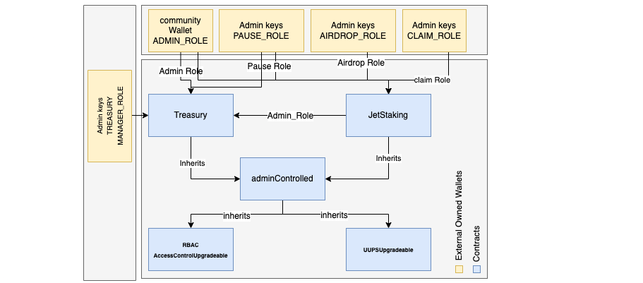
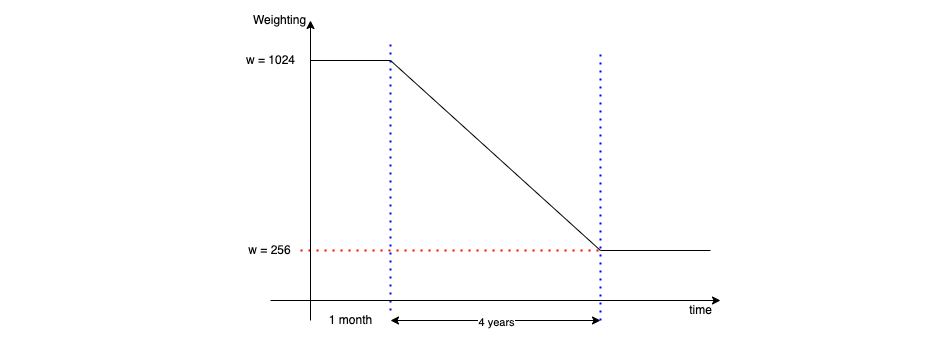

# AURORA Staking Contracts

## Table of content
- [Overview](#overview)
- [Governance](#governance)
- [Staking/Unstaking](#stake-unstake)
- [Stream Life Cycle](#stream-life-cycle)
- [Treasury](#treasury)
- [Code Documentation](#code-documentation)
- [References](#references)

## Overview

The staking contracts have a two core contracts:

- `Treasury contract`: which holds all the treasury funds, AURORA rewards, and other streams rewards.
- `Staking contract`: which implements the staking/unstaking mechanics, airdroping users, claiming stream rewards, and the stream lifecycle management.

Both contracts inherits the `adminControlled` contract that hold the access control logic.

## Governance

The target of the governance model is to support most of the expected scenarios for managing the development life cycle of the staking contracts in the future as much as possible and to optimize the process towards speed and agility.

In our governance model, some admin keys are managed by DAO with a higher privileges and others have limited privileges for specific tasks such as `AIRDROP_ROLE` admin keys. The `adminControlled` contract inherits the basic RBAC model.

Each admin key(s) is/are assigned to a specific role. The following table lists all the roles and the privileges:

| Role                  | Description           | Actions  |
| ---------------------- |:---------------------------------------:| ----------------------:|
| DEFAULT_ADMIN_ROLE      | only used by DAO with the highest privilege | ALL |
| PAUSE_ROLE      | only used by AURORA team to pause the contract in case of risking AURORA funds      |   PAUSE |
| AIRDROP_ROLE | only used by third-party service for airdroping users      |    AIRDROP |

`proxyAdminOwner` this one is not managed by the `adminControlled` contract, however it is managed by the hardhat-openzeppllin upgradeability plugin. It is only used for updating the `proxyAdmin` owner address.

## Staking/Unstaking

Users should be able to stake AURORA (deposit AURORA to the contract for some period of time). During staking, the user gets stream rewards. the user staked AURORA, a weighting coefficient is applied to the streams rewards. All the streams have the same weighting function (except the default AURORA stream which is special case).

The weighting function follows the following curve:

It is a decreasing function which creates leverage for the early stakers. It starts with `maxWeight` 100 for a month, then decays with a negative downward slope till it reach the end of the 4rth year in the reward schedule, after that it goes with a `minWeight` 25.

The user is able to unstake AURORA at any time, however in such a case, the weighting coefficient is reapplied to the stream rewards for the whole AURORA stake. Also it is important to note that users `MUST` claim their rewards before unstaking their AURORA tokens.

## Stream Life Cycle

## Code Documentation

Before you read the contract, you should be aware about the following keywords:

### User Data:

- Deposit: the amount of user's deposited AURORA in the staking contract
- RPS : reward per share during the previous withdrawal
- Pendings: amount of tokens avaialble after a `tau` period from the stream > 0
- AuroraShares: user's AURORA shares
- StreamShares: user's other stream shares
- releaseTimes: the release moment for the pending tokens

### Stream Data
- Owner: the stream owner
- reward token: the stream reward token (e.g TRI)
- Aurora Deposit Amount: Amount of the AURORA deposited by the Admin. AURORA should be transferred through transferFrom method of the AURORA ERC-20
- Aurora Claimed Amount: the claimed aurora amount by the stream owner
- 

The full code documentation can be found [here](contracts/index.html). It can be only accessed on the localhost.