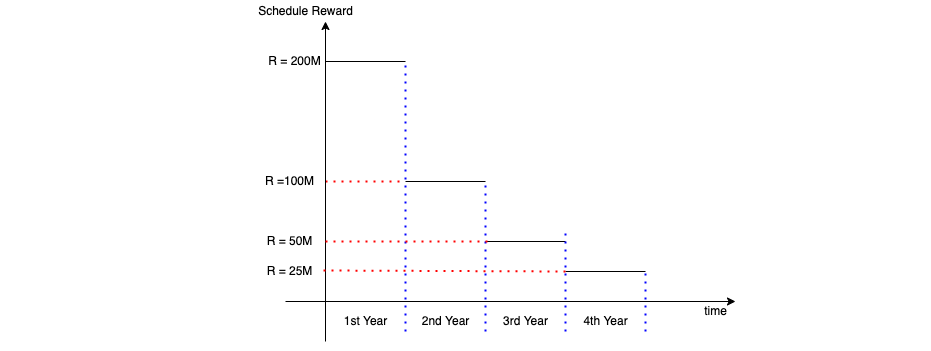

# AURORA Staking Contracts

## Table of content
- [Overview](#overview)
- [Governance](#governance)
- [Staking and Unstaking](#staking-and-unstaking)
- [Stream Life Cycle](#stream-life-cycle)
- [Treasury](#treasury)
- [Code Documentation](#code-documentation)
- [References](#references)

## Overview

The staking contracts have two core contracts:

- `Treasury contract`: which holds all the treasury funds, AURORA rewards, and other streams rewards.
- `Staking contract`: which implements the staking/unstaking mechanics, airdroping users, claiming stream rewards, and the stream lifecycle management.

Both contracts inherit the `adminControlled` contract that holds the access control logic.

## Governance

The target of the governance model is to support most of the expected scenarios for managing the development life cycle of the staking contracts in the future as much as possible and to optimize the process towards speed and agility.

In our governance model, some admin keys are managed by DAO with a higher privileges and others have limited privileges for specific tasks such as `AIRDROP_ROLE` admin keys. The `adminControlled` contract inherits the basic RBAC model.

Each admin key(s) is/are assigned to a specific role. The following table lists all the roles and the privileges:

| Role                  | Description           | Scope  |
| ---------------------- |:---------------------------------------:| ----------------------:|
| DEFAULT_ADMIN_ROLE      | only used by DAO with the highest privilege | ALL |
| PAUSE_ROLE      | can be used by AURORA team to pause the contract in case of risking AURORA funds or independent trusted watchdogs too.      |   PAUSE |
| AIRDROP_ROLE | only used by third-party service for airdroping users      |    AIRDROP |
| TREASURY_MANAGER_ROLE | only used to manage the treasury supported reward tokens      |    TREASURY |
| STREAM_MANAGER_ROLE | only used to manage the reward streams      |    STREAMS |

`proxyAdminOwner` this one is not managed by the `adminControlled` contract, however it is managed by the hardhat-openzeppllin upgradeability plugin. It is only used for updating the `proxyAdmin` owner address.

## Staking and Unstaking

### Staking
Users should be able to stake AURORA (deposit AURORA to the contract for some period of time). During staking, the user gets stream rewards. The user staked AURORA, a weighting coefficient is applied to the streams rewards. All the streams have the same weighting function (except the default AURORA stream which is special case). The default weighting function for the default AURORA stream is `1`.

The weighting function of other streams follows the following curve:

It is a decreasing function which creates leverage for the early stakers. It starts with `maxWeight` 1024 for a month, then decays with a negative downward slope till it reachs the end of the 4rth year (end of the schedule) in the reward schedule, after that it goes with a flat weight or `minWeight` 256. 

### Unstaking
The user is able to unstake AURORA at any time, however in such a case, the weighting coefficient is reapplied to the stream rewards for the whole AURORA stake. Also it is important to note that users `MUST` claim their rewards before unstaking their AURORA tokens.

Rewards are calculated based on the schedule function. The schedule function computes the amount of reward token/AURORA released through the stream to all users. An example of a schedule function is shown below:

### Claiming Reward
A user should be able to claim rewards. The rewards may be generated by different streams (see next), so a user should specify the stream that he claims.

Claiming transfers stream rewards in pending release stage for a (`tau` period). The duration of release time (`tau`) is configurable by the admin of the contract and might be different for different streams. After this time lapses, the claimed rewards can be withdrawn.

## Stream Life Cycle

There are four phases in the stream life cycle:

### *Stream Proposal*

An admin of the staking contract can whitelist a stream. Whitelisting of the stream provides the option for the stream creator (presumably the issuing party of a specific token) to deposit some ERC-20 tokens on the staking contract and potentially get in return some AURORA tokens. Deposited ERC-20 tokens will be distributed to the stakers over some period of time. Here are the parameters of the whitelisting method:

- Amount of the AURORA deposited by the Admin. AURORA should be transferred through transferFrom method of the AURORA ERC-20
- Stream creator address – only this account would be able to create a stream
- Rewards token address – the address of the ERC-20 tokens to be deposited in the stream
- The upper amount of the tokens, that should be deposited by the stream creator. In case the creator deposits less than the specified amount, the amount of released AURORA is decreased proportionally. All the rest of AURORA is transferred back to the admin.
- Max block height, until which the option to create the stream is active. This is implicitly calculated using the start of the schedule times.
- Rewards schedule, specified as an array of tuples (block height, amount of reward tokens that is kept on the staking contract at this block height). This array specifies the piecewise-linear dependency of the decay of the reward in the stream.

Note: the release of AURORA tokens to the stream creator is subjected to the same schedule as rewards. Thus if for a specific moment in time 30% of the rewards are distributed, then it means that 30% of the AURORA deposit can be withdrawn by the stream creator too.

Important: the allowed mechanics of the streams might be useful for two use cases.

First, the investment from either the community treasury or the Aurora DAO directly. One of the KPIs of the project that has received the investment might be the deposit of the specified amount of project tokens to the staking contract once the tokens are issued / released.

Second, staking contract implements the native way of doing an airdrop to the Aurora community. Any project that would like to do an airdrop now is able to use the staking contract.

### *Proposal Cancellation*
Proposal can be cancelled, if the stream creator (owner) didn't create the stream before the start of the reward schedule.

### *Stream Creation*

This method is called by the stream creator (only once) and it realizes the option that was set up during the whitelisting phase.

### *Stream Removal*

This method can be called only by the admin and cancels the reward allocations of the stream to the staking users and the distribution of the AURORA to stream creator. This is a blacklisting functionality that is intended to be used only in emergency situations. The remainder of the rewards tokens and AURORA should be able to be transferred by the admin to any Aurora account.

## Treasury

The treasury contract is used to manage the treasury funds. It should support:

- Only allow treasury managers to approve suppoted streams tokens addresses.
- Exposes the reward payments (controlled by staking contract).

## Code Documentation

Before you read the contracts, you should be aware about the following keywords:

### User Data:

- Deposit: the amount of user's deposited AURORA in the staking contract
- RPS : reward per share during the previous withdrawal
- Pendings: amount of tokens avaialble after a `tau` period from the stream > 0
- AuroraShares: user's AURORA shares
- StreamShares: user's other stream shares
- releaseTimes: the release moment for the pending tokens

### Stream Data
- Owner: the stream owner
- reward token: the stream reward token (e.g TRI)
- Aurora Deposit Amount: Amount of the AURORA deposited by the Admin. AURORA should be transferred through transferFrom method of the AURORA ERC-20
- Aurora Claimed Amount: the claimed aurora amount by the stream owner
- Reward Deposit Amount: the reward stream token deposit amount 
- reward Claimed Amount: the amount of the claimed reward stream to users
- max Deposit Amount: the max deposit of the AURORA by the admin
- Last Time Owner Claimed: last time reward claimed by the stream owner
- tau: the release period for the stream
- rps: Reward per share for a stream j>0
- schedule: an array of times and rewards schedule for a stream
- isProposed: is stream proposed flag
- isActive: is stream created flag

The full code documentation can be found [here](contracts/index.html). It can be only accessed on the localhost.

## References
- [AURORA staking and the community treasury](https://forum.aurora.dev/t/aurora-staking-and-the-community-treasury/75)
- [AURORA staking V2](https://forum.aurora.dev/t/aurora-staking-v2/243)
